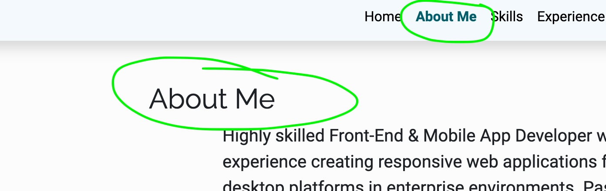

# Bug: Navbar Current Menu Selection Not Highlighted and Spelling Inconsistencies

## Description
The current menu item in the navigation bar is not visually highlighted when selected, impacting usability and user experience. Additionally, some text in the application uses US spelling instead of the required UK/AU/NZ spelling conventions.

## Steps to Reproduce
1. Navigate to the application and open the navbar.
2. Select any menu item.
3. Observe that the selected menu item is not visually highlighted.
4. Check the spelling of the following terms:
    - "Color" (should be "Colour")
    - "Customize" (should be "Customise")
    - Any others as applicable.

## Expected Behaviour
- The current menu item in the navbar should be visually highlighted to indicate it is active.
- All spelling should follow UK/AU/NZ conventions consistently across the application.

## Screenshots

> Correctly highlighted example

## Acceptance Criteria
- [X] The selected menu item in the navbar is visually highlighted.
- [X] All instances of US spelling are corrected to UK/AU/NZ spelling conventions.
- [X] Changes are tested and verified in the staging environment.

## Priority
High (user-facing issue impacting usability and professionalism).

## Environment
- **Browser:** Chrome, Firefox, Safari
- **Platform:** Windows, macOS
- **Environment:** Development, Staging, Production

## Additional Notes
- Refer to the project's style guide for the preferred spelling conventions.
- Ensure no regressions in navigation bar functionality.

---

**Assigned To:** Steven Thompson  
**Labels:** Bug, UI/UX, High Priority  
**Sprint:** 1  
**Story Points:** 2